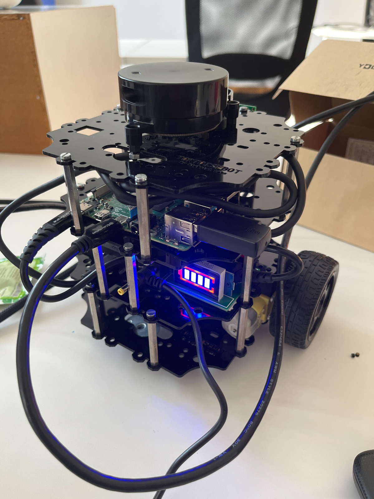
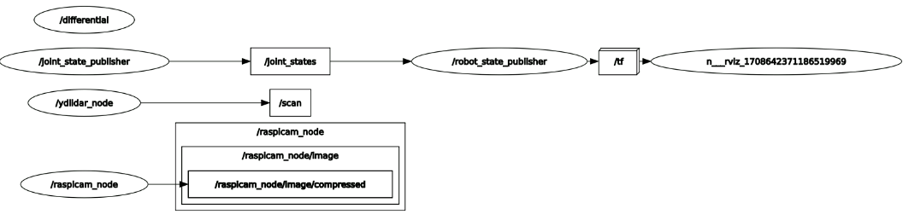

# my-tortoisebot

## v1. Connect the robot from The Construct

Use SSH to connect (the web platform is a computer that's not mine)

    ssh tortoisebot@master

Launch the ROS1 drivers of the robot 

    noetic # this will source ROS Noetic
    roslaunch tortoisebot_firmware bringup.launch

In the platform's computer (ubuntu with ROS) I'm able to do

    source /opt/ros/noetic/setup.bash
    rostopic list
    rostopic pub -1 /cmd_vel geometry_msgs/Twist -- '[0.0, 0.0, 0.0]' '[0.0, 0.0, 1.0]'
    rviz

## v2. Connect the robot from my computer

Use SSH to connect locally, start scanning the robot's ip with "Fing" app

    ssh tortoisebot@the_ip_of_your_robot

Launch the ROS1 drivers of the robot 

    noetic # this will source ROS Noetic
    roslaunch tortoisebot_firmware bringup.launch

In my computer (windows without ROS) **after opening another ssh session** I'm able to do

    rostopic list
    rostopic pub -1 /cmd_vel geometry_msgs/Twist -- '[0.0, 0.0, 0.0]' '[0.0, 0.0, 1.0]'

## Others

In the web platform this is rqt_graph

